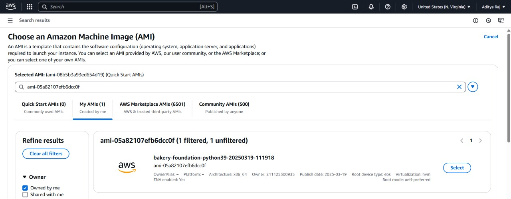
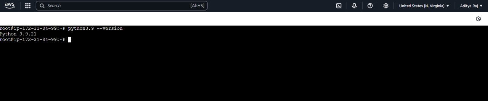

# Bakery Foundation Example on Windows 🍞

## Overview

This guide provides step-by-step instructions on setting up and using **Packer** to create a machine image (AMI) on AWS. It covers installation, configuration, and deployment on Windows.

## Prerequisites

Before starting, ensure you have:

- A **Windows** machine with administrator access.
- An **AWS account** with IAM credentials.
- Basic knowledge of AWS and PowerShell.

---

## Step 1: Install Required Tools

### 1.1 Install Packer

#### Step 1: Download Packer  
1. Open your browser and go to the **[Packer Download Page](https://www.packer.io/downloads)**.  
2. Download the latest **Windows (64-bit) ZIP file**.  

#### Step 2: Extract Packer  
1. Navigate to the downloaded ZIP file.  
2. Right-click and select **Extract All...**  
3. Move `packer.exe` to `C:\packer` (Create this folder if it doesn’t exist).  

#### Step 3: Add Packer to System PATH  
1. Open **Environment Variables** (Search for it in Windows).  
2. Click **Environment Variables** → Under **System Variables**, find `Path` → Click **Edit**.  
3. Click **New**, then add:  
```
C:\packer
 ```
4. Click **OK** and close all windows.  

#### Step 4: Verify Packer Installation  
Open PowerShell and run:

```powershell
packer --version
```

✅ If successful, the **Packer version** will be displayed.

---

### 1.2 Install AWS CLI

#### Step 1: Download AWS CLI  
1. Go to the **[AWS CLI Download Page](https://aws.amazon.com/cli/)**.  
2. Download and run the `AWSCLI.msi` installer.  

#### Step 2: Install AWS CLI  
1. Follow the on-screen steps: **Next → Next → Finish**.  
2. Verify installation:

```powershell
aws --version
```

✅ If successful, it should display something like: aws-cli/2.x.x Windows/10

---

### 1.3 Configure AWS CLI (5 minutes)  

Run the following command in PowerShell:

```powershell
aws configure
```

Enter the following when prompted:  
- **AWS Access Key ID**: `<Your AWS Key>`  
- **AWS Secret Access Key**: `<Your AWS Secret>`  
- **Default region name**: `us-east-1` (or your preferred region)  
- **Default output format**: `json` (Press Enter)  

✅ AWS CLI is now configured.

---

## Step 2: Create the Packer Template

### 2.1 Create the Packer HCL File

1. Open **Notepad** or **VS Code**.
2. Copy the following code into a new file:

```hcl
packer {
  required_plugins {
    amazon = {
      source  = "github.com/hashicorp/amazon"
      version = ">= 1.0.0"
    }
  }
}

variable "aws_region" {
  default = "us-east-1"
}

source "amazon-ebs" "python39" {
  ami_name      = "bakery-foundation-python39-${formatdate("YYYYMMDD-HHmmss", timestamp())}"
  instance_type = "t2.micro"
  region        = var.aws_region
  source_ami    = "ami-0a25f237e97fa2b5e"
  ssh_username  = "ubuntu"
}

build {
  sources = ["source.amazon-ebs.python39"]

  provisioner "shell" {
    inline = [
      "sudo apt-get update",
      "sudo apt-get install -y python3.9 python3.9-venv python3.9-dev"
    ]
  }
}
```

3. Save the file as **`bakery.pkr.hcl`** in `C:\packer`.

---

### 2.2 Find a Valid Ubuntu AMI (The AMI ID varies by AWS region, so we need to select the correct one)

Run the following AWS CLI command to get the latest Ubuntu AMI:

```powershell
aws ec2 describe-images --owners 099720109477 --filters "Name=name,Values=ubuntu/images/hvm-ssd/ubuntu-focal-20.04-amd64-server-*" --query "Images | sort_by(@, &CreationDate)[-1].ImageId" --output text
```

✅ Update `bakery.pkr.hcl` by replacing the **`source_ami`** with the new AMI ID:

```hcl
source "amazon-ebs" "python39" {
  ami_name      = "bakery-foundation-python39-${formatdate("YYYYMMDD-HHmmss", timestamp())}"
  instance_type = "t2.micro"
  region        = var.aws_region
  source_ami    = "ami-xxxxxxxxxxxxxxx"  # Replace with actual AMI ID
  ssh_username  = "ubuntu"
}
```

---

## Step 3: Validate and Build the Image

### 3.1 Initialize and Validate Packer Template

1. Open PowerShell and navigate to `C:\packer`:

```powershell
cd C:\packer
```

2. Initialize Packer:

```powershell
packer init .
```

3. Validate the template:

```powershell
packer validate bakery.pkr.hcl
```

✅ Expected Output: The configuration is valid.

---

### 3.2 Build the Machine Image

Run the following command:

```powershell
packer build bakery.pkr.hcl
```

This will:
- Create a **temporary EC2 instance**.
- Install **Python 3.9**.
- Convert it into an **Amazon Machine Image (AMI)**.
- Delete the temporary instance.

---

## Step 4: Deploy and Test the AMI

### 4.1 Find the AMI  
1. Log in to **AWS Console**.  
2. Navigate to **EC2 → AMIs** (Set the region you used when creating the AMI).  
3. Find the AMI named: bakery-foundation-python39-timestamp

---

### 4.2 Launch an EC2 Instance with Your AMI  

1. Go to **AWS EC2 Console**: [AWS EC2 Dashboard](https://console.aws.amazon.com/ec2).  
2. Click **Launch Instance** → **My AMIs** (Left Sidebar).  
3. Search for your AMI and **Select It**.  
4. Choose:  
   - **Instance Type**: `t2.micro` (or higher, based on your needs).  
   - **Key Pair**: Use an existing key or create a new one.  
   - **Security Group**: Allow **SSH (port 22)** and other required ports.  
5. Click **Launch**! 🚀

---


### 4.3 Verify Python Installation  

Once inside the instance, run:

```bash
python3.9 --version
```

✅ Expected Output:

```bash
Python 3.9.21
```

---

## 📸 Result Screenshots

### 1. AMI Created Successfully

After running the `packer build` command, you should see an output similar to the following:

```bash
==> Builds finished. The artifacts of successful builds are:
--> amazon-ebs.python39: AMIs were created:
us-east-1: ami-xxxxxxxxxxxxxxxxx

```


This indicates that the AMI has been successfully created and is ready for use.

**Screenshot: AMI Created Successfully**



---

### 2. Running EC2 Instance with Python 3.9

After launching the EC2 instance and connecting via SSH, running the command:

```bash
python3.9 --version
```

Should return:

```bash
Python 3.9.21
```

This confirms that Python 3.9 has been successfully installed on the instance.

**Screenshot: Python 3.9 Installed on EC2 Instance**



---

## Default Ubuntu Python Version

- The default Python version that comes pre-installed in **Ubuntu 20.04** is **Python 3.9**.
- This is why running the following command:

  ```bash
  python3 --version
  ```

  Returns:

  ```
  Python 3.8.10
  ```

---

## Manually Installed Python 3.9

- You installed Python 3.9 using:

  ```bash
  sudo apt-get install -y python3.9
  ```

- Since Ubuntu manages multiple Python versions, **Python 3.9** is available as `python3.9`, **not** `python3` by default.
- Running:

  ```bash
  python3.9 --version
  ```

  Returns:

  ```
  Python 3.9.21
  ```

---

## No `python` Command by Default

- Running:

  ```bash
  python --version
  ```

  Results in:

  ```
  Command 'python' not found
  ```

- This is because Ubuntu only includes **python3**, not **python**.

---

## Why Ubuntu Uses `python3` Instead of `python`

### 1. Legacy vs. Modern Versions

- Older versions of **Ubuntu (before 20.04)** included both **Python 2** and **Python 3**.
- `python` used to refer to **Python 2**, while `python3` referred to **Python 3**.
- Since **Python 2 reached end-of-life (EOL) on January 1, 2020**, Ubuntu **20.04 and later removed Python 2**.
- Instead of making `python` an alias for `python3`, **Ubuntu forces users to explicitly use `python3` to avoid confusion**.

### 2. Ubuntu’s Decision to Not Include `python`

- If `python` was included by default, **scripts written for Python 2 might break** on newer systems.
- To enforce clarity, **Ubuntu only includes `python3`**, and `python` is **not available by default**.
- Running `python` without installing it gives: Command 'python' not found

---

## Conclusion  

You have successfully set up **Packer**, created an **AWS AMI**, and deployed an **EC2 instance** with Python 3.9! 🚀  

---

### Additional Tips

- **Optimize Your AMI**: Consider adding more provisioning steps to customize your AMI further.
- **Automate with CI/CD**: Integrate Packer with your CI/CD pipeline for automated image builds.
- **Monitor Costs**: Keep an eye on your AWS billing to avoid unexpected charges.

### Troubleshooting

- **SSH Connection Issues**: Ensure your security group allows SSH access and your key pair is correctly configured.
- **Packer Build Failures**: Check the Packer logs for detailed error messages and validate your template again.

### Further Reading

- [Packer Documentation](https://www.packer.io/docs)
- [AWS EC2 User Guide](https://docs.aws.amazon.com/AWSEC2/latest/UserGuide/concepts.html)
- [Python Installation Guide](https://docs.python.org/3/using/index.html)

---

Enjoy baking your machine images with Packer! 🍞✨